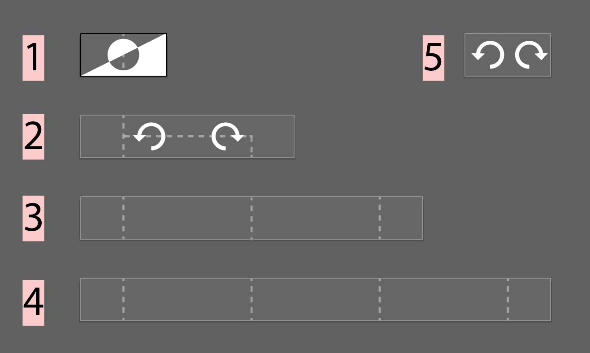

# How to Create a Logic Block

### Introduction
The Logic Block is a tiny program modul. This modul can be connected with other modules using the visual LogicCrafting editor within the Reality Editor. As such you can think about the Logic Block as one function within a programm. The visual editor allows you to connect your function with other functions to form a small program unit. 

###Importent to know

+ Logic Blocks are realtime data-flow programs. This means, that data flow will call your program modul as often as 60 times per second.
+ Logic Blocks are bound to your Reality Server. This means, that the Reality Editor can use your block only with the Logic Nodes that are saved to and Object hostet in your Server. However the Logic Nodes can be connected with any other object hostet in any other server.

### Logic Block Components
Each Logic Block is stored in the folder `libraries/logicBlocks/YourBlockName`
YourBlockName should be the name of the block you want to create. The folder has the following content:

1. `index.js` Stores the code for the program module
2. `gui/icon.svg` Icone of your Block as it will apear in the selection menu
3. `gui/label.svg` Label of your Block used in the programming interface.
4. `gui/index.html` The Settings page for your Block. The setting opens when you tap on your block while it is used in the programming interface.

Given these 4 components, your Logic Block will automatically be discovered, activated and exposed to the Reality Editor LogicCrafting interface.

### Program Module (index.js)
The index.js file has three importnat program parts.

1. A JSON object called `generalProperties` that defines all global  and default properties of the Logic Block.
2. A `setup` function that is called once when the server initializes
3. A `render` function that is called each time a new data packages flows through the Logic Block


#### generalProperties 
```
var generalProperties = {
    name : "scale",
    blockSize : 1,
    privateData : {},
    publicData : {scale : 1},
    activeInputs : [true, false, false, false],
    activeOutputs : [true, false, false, false],
    iconImage : "icon.svg",
    nameInput : ["in", "", "", ""],
    nameOutput : ["out", "", "", ""],
    type : "scale"
};
```


|  Variable | Functionality |
|:-- |:--|
| name     |  The Name of your Logic Block. It should match with the name of your Logic Block Folder |   
| blockSize      | Sets the with of your Logic Block. Possible values are 1, 2, 3 and 4      |    
| privateData | privateData is instantiated by every single logic Block stored in a Logic Node. Data stored in this object is never exposed to the Reality Editor or other Servers. Use privateData to store login credentials for web services and so on. |   
| publicData | publicData is instantiated by every single logic Block stored in a Logic Node. Use publicData to store default values and persistant data that should be used every time your logicBlock is triggered. For example, if you want to provide a setup method to set scaling for a scaling block, then you would add a value in publicData to store this setting. Your program will make use of this data, everytime it is called. |   
| activeInputs     |  This tells the Reality Editor if the block input is active. Because each block can range from one to four block sizes, activeInputs has 4 values. Think about your block spaning the range of 4 blocks, you will have 4 possible inputs. With this setting you can define which of the inputs are active and linkable. |
| activeOutputs      | The same as for  activeInputs, just with the outputs    |    
| iconImage     |  Defines the file used as iconImage |    
| nameInput     |  Give every possible input of your block a name. |    
| nameOutput    |  Give every possible output of your block a name. |    
| type   |  Define the type of your block. This is usually equal to your block name |    

      

#### setup
```
exports.setup = function (object,logic, block, activeBlockProperties){
// add code here that should be executed once.

};
```

The setup function is called only when your block is initialized. Use this to initialize your block.

The following parameters are handed over to the setup function:

|  Parameter | Functionality |
|:-- |:--|
| object     |  UUID for the Object in which the Logic Node is operating. |   
| logic     |  UUID for the Logic Node in which the Logic Block is operating. |   
| block     |  UUID for the Logic Block |   
| activeBlockProperties     |  access to the properties saved for the single instance of a Logic Block. The activeBlockProperties is basically a copy of **generalProperties**.  |   


#### render
```
exports.render = function (object, node, block, index, thisBlock, callback) {

    for (var key in thisBlock.data[0]) {
        if(key === "value"){
            console.log(thisBlock.data[0][key]);
            thisBlock.processedData[0][key] = thisBlock.data[0][key] *  thisBlock.publicData.scale;
        } else {
            thisBlock.processedData[0][key] = thisBlock.data[0][key];
        }
    }

    callback(object, node, block, index, thisBlock);

};
```

The code above describes a simple logic Block for scaling a value. The data processed in the block is never handed over by it self, but stored in the thisBlock object as a pointer. There are three important components to process data. The **thisBlock.data[index]** object stores a Reality Editor data Object with the data that needs to be processed by the Logic Block, **processedData[index]** stores the results in a Reality Editor data object and publicData stores all parameters. In this case there is a parameter scale stored.

Function Parameter:

|  Parameter | Functionality |
|:-- |:--|
| object     |  UUID for the Object in which the Logic Node is operating. |   
| node     |  UUID for the Logic Node in which the Logic Block is operating. |   
| block     |  UUID for the Logic Block |   
| index     |  Each logic Block data value is organized in an array of four. For example, if the block spans 3 block sizes, it will have three data values stored in this array. The index tells the render function on which data value the function call is executed. |   
| thisBlock     |  Pointer to the Logic Block instance. This instance has the following attributes: <br> **data[index]**: The data object to be processed by the Logic Block <br> **publicData**: copy of the generalProperties publicData  <br> **processedData[index]**:  Processed data object should be stored here, before the callback is called. |   
| callback     |  Callback to be called for when data is processed |   


CallBack Parameter:

|  Parameter | Functionality |
|:-- |:--|
| object     |  UUID for the Object in which the Logic Node is operating. |   
| node     |  UUID for the Logic Node in which the Logic Block is operating. |   
| block     |  UUID for the Logic Block |   
| index     |  Each logic Block data value is organized in an array of four. For example, if the block spans 3 block sizes, it will have three data values stored in this array. The index tells the render function on which data value the function call is executed. **The callback can be called multiple times with different index, in case more then one output is triggerd.**  |  
| thisBlock     |  Pointer to the executed block |   

Finally you may want to know how how the data object looks like:

```
function Data() {
    this.value = 0;
    this.mode = "f";
    this.unit = "";
    this.unitMin = 0;
    this.unitMax = 1;
}
```

|  Value | Functionality |
|:-- |:--|
| value     |  This is the number you want to process. Keep in mind that the editor only processes floating point values between 0.0 and 1.0 |   
| mode     |  f = floating point |   
| unit     |  You can add a unit like "cm" or "F" |   
| unitMin     | Since the editor only uses 0.0 ~1.0 you can define a minimum in case you want to scale back to original scale. |   
| unitMax    |  Since the editor only uses 0.0 ~1.0 you can define a maximum in case you want to scale back to original scale. |   


### Icon and Label
Open `libraries/blockIconTemplates.pdf` in Adobe Illustrator.
It should look like this:



Each of the templates is a separate page. You can save each as a seperate SVG depending which size you prefer.

Note that the doted line show the input and the output. As a Style guide, try to use the doted line to indicate how the data is flowing through your Logic Block.

### Index.html
This page is used for setup and open when you tap on a logic node currently in use. You can use this page to login to services or adjust data stored in the publicData object.

```
<!DOCTYPE html>
<html lang="en">
<head>
    <meta charset="UTF-8">
    <title>Setup Slider</title>
    <script src="../../../objectDefaultFiles/object.js"></script>
</head>
<body>
<div id="done" style="display: none">
<div class="number" id="number"><span id="numbervalue">0 ms</span><br>
<input id="slider" type="range" value="100" min="0" max="400" style="width:90%"></div>
</div>
<script>
    var logic = new HybridLogic();
    var number = document.getElementById('numbervalue');
    var scaleValue = logic.readPublicData("scale", 1);

    writeNumber(scaleValue);
    slider.value = scaleValue*100;

    slider.addEventListener("input", function () {
        writeNumber(slider.value/100);
        logic.writePublicData("scale",  slider.value/100);
       // logic.writePrivateData("delayTime",  slider.value);
    }, false);

    logic.addReadPublicDataListener("scale",function (scaleValue){
        document.getElementById('done').style.display = "inline";
        writeNumber(scaleValue*100);
    	slider.value = scaleValue*100;
    });

    function writeNumber(value){
            number.innerHTML =  value+" X";
    }

</script>
</body>
</html>
```

The code above illustrates a slider that changes the scale value for the logic Block code described earlier. The following functionallity is available:

Reference the right library:
`<script src="../../../objectDefaultFiles/object.js"></script>`
    
Initialize an instance of the logic library:<br>
`var logic = new HybridLogic();`


Read Data from the publicData object: <br>
`logic.readPublicData("scale", 1)` // the one marks a default value.

Write Data to the publicData object: <br>
`logic.writePublicData("scale",  slider.value/100);`

Add a callback to get live data for when the publicData content changes externally:

```
  logic.addReadPublicDataListener("scale",function (value){
      // place your event response here
  });
```

As an additional functionality you can write data to the privateData object, however there is no way to read that data, because this data is not accessable for the Reality Editor to read:<br>
`logic.writePrivateData("password",  password);`

